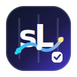

<p align="center">
  
</p>

<h1 align="center">sLoom</h1>

**sLoom** (`sloom`) is an **open-source**, skill-first orchestrator CLI for turning scattered engineering `SKILL.md` files into routable, reviewable, executable workflows.

[中文文档](README.zh-CN.md)

## Logo meaning

**Skill Loom** means weaving scattered engineering Skills into an executable workflow by dependency, stage, permission, and quality gates. The `sL` monogram connects the project name with this metaphor: `s` stands for Skill, `L` stands for Loom, the woven thread represents workflow orchestration, and the check mark represents reviewable quality gates.

The core idea is simple:

> **Skill is the first abstraction.** Claude Code, Codex, shell, and multi-agent runtimes are execution backends, not the place where workflow policy lives.

```text
Task / Issue
  -> Skill Catalog
  -> Router
  -> Blueprint Planner
  -> DAG Validator
  -> Deterministic Executor
  -> Artifacts + Gates + Trace
```

## Current status

This repository contains the first open-source MVP scaffold:

- zero-dependency Node.js 22 CLI
- local skill indexer for `SKILL.md` plus non-invasive metadata overlays
- catalog linter
- lexical router with pack filtering
- bugfix / feature blueprints
- artifact DAG planner
- plan validator
- Mermaid graph output
- dry-run trace writer
- workflow artifact runtime with resumable run state
- safe shell executor and agent handoff runtime
- Codex / Claude Code / CAO dispatch packages
- example skills, pack, blueprint, and workflow plan

SQLite/FTS, LLM rerank, direct opt-in subprocess execution, worktree isolation, richer CAO log harvesting, and stricter gates are planned next milestones.

## Quick start

### Use the npm package first

Requires Node.js 22+. Install the CLI globally, or run it directly with `npx`:

```bash
npm install -g sloom
sloom --help

# Or without global installation
npx sloom --help
```

Create a local sLoom workspace and try the built-in example Skills bundled with the package:

```bash
mkdir sloom-demo && cd sloom-demo
sloom init
sloom index
sloom skills list

sloom route "修复资源列表搜索为空时报错" --json
sloom plan --task "修复资源列表搜索为空时报错" --blueprint bugfix --out .sloom/plans/search-empty-bug.json
sloom validate .sloom/plans/search-empty-bug.json
sloom graph .sloom/plans/search-empty-bug.json
sloom run .sloom/plans/search-empty-bug.json --executor auto --max-nodes 2
sloom runs
```

Use your own Skills by passing their directories explicitly:

```bash
sloom scan ~/.agents/skills ~/.codex/skills --out .sloom/inventory.json
sloom propose --from .sloom/inventory.json --out .sloom/proposals/overlays.json
sloom apply .sloom/proposals/overlays.json --yes --backup
sloom index ~/.agents/skills ~/.codex/skills
sloom route "implement a small bugfix and run regression tests"
```

Evaluate routing and planning quality with the bundled golden dataset:

```bash
sloom eval
sloom eval --json --out .sloom/reports/development-flow.json
```

### Development from source

When working inside this repository, you can still run the CLI without installing the package:

```bash
node packages/cli/bin/sloom.js --help
node packages/cli/bin/sloom.js index examples/skills
node packages/cli/bin/sloom.js eval evals/development-flow.json
```

## Workflow execution and artifacts

`sloom run` now creates a durable run directory under `.sloom/runs/<run-id>`:

```text
.sloom/runs/<run-id>/
  plan.lock.json
  run-state.json
  events.jsonl
  artifacts/
    manifest.json
    <node-id>/<artifact-name>.md
```


P3/P4 run directories may also include agent handoff and dispatch packages:

```text
.sloom/runs/<run-id>/
  handoffs/<node-id>/
    task.md
    inputs.json
    expected-outputs.json
  dispatches/<node-id>/<adapter>/
    prompt.md
    dispatch.json
    status.json
    launch-cao.sh        # CAO only
```

This keeps sLoom usable inside Claude CLI or Codex CLI today: sLoom owns routing, plan locking, policy, state, events, and artifacts; the surrounding agent executes the generated handoff task and submits the result. See [Agent Integration](docs/agent-integration.md) and the optional [sLoom Entry Skill](skills/sloom-orchestrator/SKILL.md).

The default local runtime is deterministic and safe: it does not mutate source files. It materializes each node output as a traceable artifact so the workflow can be inspected and resumed.

P3 added explicit executor adapter mode. `--executor auto` runs policy-approved shell nodes with a small safe-command allowlist, and turns Codex / Claude Code nodes into durable handoff packages instead of secretly spawning agents or mutating your code. P4 extends this into provider dispatch packages: `--executor codex`, `--executor claude-code`, and `--executor cao` create auditable launch prompts/specs, with CAO `allowedTools` derived from sLoom policy. A real agent can complete the node, write a Markdown artifact, submit it back with `sloom artifact put`, and then `sloom resume --executor auto|cao` continues the DAG.

Useful commands:

```bash
node packages/cli/bin/sloom.js executors
node packages/cli/bin/sloom.js run .sloom/plans/search-empty-bug.json --max-nodes 2
node packages/cli/bin/sloom.js run .sloom/plans/search-empty-bug.json --executor auto
node packages/cli/bin/sloom.js run .sloom/plans/search-empty-bug.json --executor cao
sh .sloom/runs/<run-id>/dispatches/<node-id>/cao/launch-cao.sh
node packages/cli/bin/sloom.js artifact put <run-id> analysis requirement.spec ./requirement.spec.md --executor cao
node packages/cli/bin/sloom.js resume <run-id> --executor cao
node packages/cli/bin/sloom.js runs --json
```


## Quality evaluation

P5 adds a lightweight evaluation loop so teams can prove sLoom is improving the workflow instead of just adding orchestration ceremony:

```bash
node packages/cli/bin/sloom.js eval evals/development-flow.json
```

The report checks route top-3 recall, plan Skill recall, expected Artifact coverage, estimated human interventions, and prompt pollution reduction. See [Team Adoption Guide](docs/guides/team-adoption.md) for the demo script and rollout checklist.

## Repository layout

```text
packages/
  core/              catalog, routing, planning, validation, graph utilities
  cli/               command-line entry point
blueprints/          workflow skeletons: bugfix, feature
packs/               curated skill sets, routing policies, and metadata overlays
schemas/             JSON Schemas for metadata overlays and plans
examples/            example skills and plans
docs/                architecture notes, agent integration, team guide, and roadmap
evals/               golden route/plan quality datasets
scripts/demo/        reproducible demo scripts
skills/              optional sLoom Entry Skill for agent natural-language use
```

## Skill metadata overlay

sLoom should not mutate your existing local skills by default. The `scan -> propose -> apply --backup` workflow keeps every metadata change reviewable and reversible. Treat `SKILL.md` directories as read-only source assets, then store orchestration metadata in the project workspace or in a pack:

```text
# Existing skill, read-only
~/.claude/skills/my-skill/
  SKILL.md

# sLoom-owned orchestration metadata
.sloom/overlays/skills/implementation.targeted-fix.json

# Or a shared/open-source pack overlay
packs/frontend-delivery/skills/implementation.targeted-fix.json
```

A same-directory `sloom.json` remains supported only as an optional portable metadata file when the skill author intentionally ships it with the skill. It is not the default governance model for existing local skills.

Minimal overlay shape:

```json
{
  "apiVersion": "sloom.dev/v1alpha1",
  "kind": "SkillOverlay",
  "metadata": {
    "id": "implementation.targeted-fix",
    "version": "1.0.0",
    "title": "Targeted Fix Implementation",
    "source": {
      "type": "local-skill",
      "path": "examples/skills/targeted-fix",
      "fingerprint": "sha256:..."
    }
  },
  "spec": {
    "intents": ["bugfix", "feature"],
    "capabilities": ["implementation", "small-change"],
    "inputs": { "required": ["repo.context"], "optional": ["requirement.spec"] },
    "outputs": ["source.diff", "implementation.summary"],
    "execution": { "preferredExecutor": "claude-code", "workspace": "isolated-worktree", "timeoutMinutes": 40 },
    "policy": { "risk": "medium", "permissions": ["filesystem.write", "git.diff"], "denyCommands": ["rm -rf", "git push"] },
    "routing": { "includeKeywords": ["修复", "bug", "实现"], "tags": ["implementation"] }
  }
}
```

## Design principles

1. **Artifact-first**: nodes pass named artifacts, not hidden chat history.
2. **Plan before run**: the DAG must be frozen and validated before execution.
3. **Minimal closed DAG**: choose only the smallest set of skills needed to satisfy artifact dependencies.
4. **Policy as code**: permissions, command deny-lists, gates, and approval points must be enforceable outside prompts.
5. **Executors are adapters**: Claude Code, Codex, shell, and CAO execute planned nodes; they do not own skill selection.

## Roadmap

See [`docs/roadmap.md`](docs/roadmap.md) for the full plan. The next implementation milestones are:

- replace JSON catalog with SQLite + FTS5
- add stricter schema validation
- support YAML round-trip for plans and metadata overlays
- add opt-in real subprocess/session monitoring for Codex, Claude Code, and CAO
- add git worktree isolation
- expand route / planning eval datasets with real team tasks

## License

MIT
