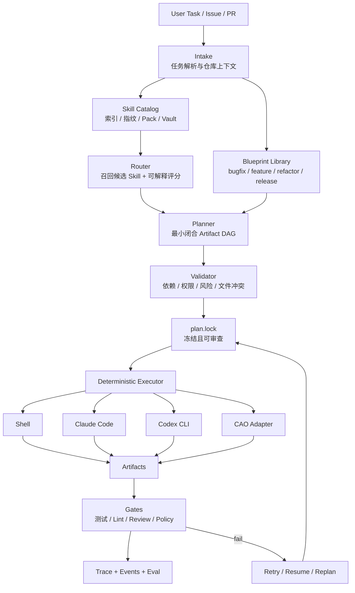

# sLoom：Skill-first Orchestrator CLI 重新分析与开发计划

> 重新分析目标：对比当前 `sLoom` 与本地三个参考项目 `/Users/ke/Desktop/cli-agent-orchestrator`、`/Users/ke/Desktop/skill-orchestration-system`、`/Users/ke/Desktop/stack-forge-lwc`，吸收它们真正有价值的部分，同时围绕用户的核心诉求重新收敛产品边界与工程计划。

## 0. 用户诉求与项目判断

### 0.1 当前真实问题

团队已经沉淀了大量好用的 Skill，覆盖研发全流程，例如需求澄清、代码理解、实现、测试、Review、发布检查、故障诊断等。但这些 Skill 目前仍然是分散的“元 Skill”：

- 人知道它们好用，但机器不知道什么时候该用哪个。
- 单个 Skill 能解决局部问题，但简单开发任务仍然需要人手动串流程。
- Skill 分散在不同目录、不同命名体系、不同 Agent 生态中，缺少统一索引。
- 对简单研发任务，理想体验应该是：输入任务 → 自动选择 Skill → 自动生成计划 → 自动执行/半自动执行 → 产物可追踪。

因此，`sLoom` 的本质不是“再造一个 Agent”，而是把现有 Skill 变成一个可路由、可编排、可执行、可审计的工程系统。

### 0.2 一句话定位

**sLoom 是一个开源的 Skill-first Orchestrator CLI：将离散研发 Skill 编织成可审查、可执行、可恢复、可评估的轻量工作流。**

### 0.3 最重要的产品原则

> **Skill 是第一抽象；Agent 与 CLI 只是执行 Skill 的运行时。**

这意味着：

- `sLoom` 不应该让某个大模型在黑箱里随意决定流程。
- `sLoom` 应先建立 Skill Catalog，再做可解释路由。
- `sLoom` 应先冻结并验证 Workflow DAG，再执行。
- 所有跨节点信息都应通过 Artifact 落盘传递，而不是依赖聊天上下文。
- 失败恢复应基于状态、事件和产物，而不是“让 Agent 再猜一次”。

---

## 1. 当前 sLoom 的项目现状

当前仓库已经具备一个开源 MVP 的骨架：

```text
skill-loom/
  README.md
  README.zh-CN.md
  package.json
  packages/
    cli/              # sloom CLI
    core/             # index / route / plan / validate / graph / dry-run 核心逻辑
  schemas/            # sloom skill / config / workflow plan JSON Schema
  blueprints/         # bugfix / feature 蓝图示例
  packs/              # pack 示例
  examples/           # plan 示例
  docs/               # 架构 ADR 与 roadmap
  .sloom/             # catalog / plans / runs 工作目录
```

当前已经实现或具备雏形的能力：

| 能力 | 当前状态 | 评价 |
|---|---:|---|
| `sloom init` | 已有 | 可创建 `.sloom`、配置和 Catalog |
| Skill 索引 | 已有基础版 | 能扫描 `SKILL.md` 并生成 Catalog，但编排元数据应改为非侵入式 Overlay，还缺指纹、来源、Vault、变更计划 |
| Catalog lint | 已有基础版 | 能做重复 ID、缺字段、Artifact producer 检查 |
| Task route | 已有基础版 | 关键词/元数据评分，可解释但还不够强 |
| Plan | 已有基础版 | 能按 Blueprint 生成 WorkflowPlan，但尚未达到真实闭合 DAG |
| Validate | 已有基础版 | 能检查计划结构与依赖，但缺状态机、策略、权限、恢复校验 |
| Graph | 已有 | 可输出 Mermaid DAG |
| Run | dry-run 雏形 | 真实执行器还未落地 |

当前 `sLoom` 最应该继续推进的不是“增加更多 Agent”，而是补齐四个关键层：

1. **Skill 治理层**：大量 Skill 的发现、索引、分组、启用、版本、指纹与审查。
2. **规划层**：从任务到最小闭合 DAG，而不是固定套模板。
3. **执行与恢复层**：确定性执行、Artifact Store、事件日志、失败恢复。
4. **评估层**：验证路由是否选对、计划是否最小、产物是否满足门禁。

---

## 2. 三个参考项目的价值、边界与吸收策略

### 2.1 skill-orchestration-system：Skill 治理层参考

#### 它解决的问题

`skill-orchestration-system` 更接近一个本地 Skill 管理与动态路由注册系统。它的重点不是执行完整研发 DAG，而是治理大量 Skill：扫描、分组、生成 Pack、启用/禁用、降低上下文污染。

#### 值得吸收的长处

| 设计 | 对 sLoom 的价值 |
|---|---|
| `scan -> propose -> plan -> apply` | 将“发现与变更”拆成可审查步骤，避免直接改用户环境 |
| Vault Isolation | 将大量 Skill 收入 Vault，避免全部暴露给 Agent 造成 prompt pollution |
| Pack / pointer skill | 只激活少量指针 Skill，由指针 Skill 路由到 Pack/Vault 内真实 Skill |
| Manifest schema | 记录来源、目标路径、同步策略、触发词、指纹、启用状态 |
| Fingerprint | 判断 Skill 是否变化，支持同步、审计与冲突检测 |
| Backup / rollback | 修改 Skill 目录、配置、启用状态前先备份，可恢复 |
| Deterministic grouping | 主要基于 Skill head metadata，而不是完全依赖模型自由生成 |
| 删除与启用分离 | 防止“整理 Skill”误删源文件 |

#### 不应照搬的部分

- 它不是完整研发工作流执行器。
- Pack 组织能力不能替代 Artifact DAG Planner。
- 它更关注 Skill 激活与整理，不负责复杂任务状态机。

#### 对 sLoom 的设计落点

`sLoom` 应引入一个明确的 **Skill Inventory / Activation Governance** 层：

```text
local skill dirs
  -> sloom scan
  -> inventory with fingerprints
  -> sloom propose packs / metadata overlays / pointers
  -> reviewable change plan
  -> sloom apply --approved
  -> catalog index
```

新增或强化命令建议：

```bash
sloom scan ~/.claude/skills ~/.codex/skills --out .sloom/inventory.json
sloom propose --from .sloom/inventory.json --mode pack --out .sloom/proposals/skill-packs.json
sloom apply .sloom/proposals/skill-packs.json --backup
sloom index
```

新增数据模型建议：

```yaml
apiVersion: sloom.dev/v1alpha1
kind: SkillInventoryEntry
metadata:
  id: frontend.react.feature-implementation
  sourcePath: /Users/ke/.claude/skills/react-feature
  vaultPath: .sloom/vault/frontend/react-feature
  origin: claude-skill
  fingerprint: sha256:...
  discoveredAt: 2026-07-15T00:00:00+08:00
spec:
  enabled: false
  pack: frontend-delivery
  pointerSkill: sloom-frontend-delivery
  syncPolicy: copy
  triggers: [React, 前端, 页面, 组件]
```

---

### 2.2 stack-forge-lwc：研发阶段、产物标准与 Review 方法参考

#### 它解决的问题

`stack-forge-lwc` 更像一个研发工作流生成器。它强调通过模板化 Orchestrator Skill 和 Stage Skill，让 Claude Code 按阶段推进工作，例如 diagnosis、brainstorm、specification、planning、implementation、review、release。

#### 值得吸收的长处

| 设计 | 对 sLoom 的价值 |
|---|---|
| 清晰阶段模型 | 可沉淀为 sLoom Blueprint Library |
| StageState / WorkflowState | 可作为运行状态机的参考 |
| Provider scanning / healthcheck | 可用于执行器健康检查和能力发现 |
| 需求追踪 Review | Review 不只看代码，还要回溯需求与验收条件 |
| 对抗式验证 / refuter | 对关键节点引入反驳者，提升质量 |
| 文件冲突维度并行 | 实现阶段可以按文件依赖图拆分并行批次 |
| Orchestrator Skill UX | 可生成一个“入口 Skill”给 Claude/Codex 用户使用 |

建议吸收的标准阶段集合：

```text
diagnosis       # 理解问题 / 复现 / 定位
brainstorm      # 方案发散 / 约束识别
specification   # 需求与验收标准
planning        # 技术计划 / DAG / 任务拆分
implementation  # 实现
review          # 需求追踪 + 代码质量 + 对抗验证
release         # 变更摘要 / 发布检查 / 回滚说明
```

#### 它暴露出的风险

`stack-forge-lwc` 的一些文档也指出了关键不足，这些不足正是 `sLoom` 需要避免的：

- Orchestrator 主要是 Prompt/Template，不是确定性执行器。
- State file 不等于事件日志，恢复能力不足。
- 状态迁移缺少强校验。
- Artifact 元数据不足，缺少 checksum、输入来源、provider、attempt id。
- 并行实现缺少结构化任务状态和冲突恢复。

#### 对 sLoom 的设计落点

`sLoom` 应吸收它的 **阶段 taxonomy 与交付标准**，但不把 Prompt Orchestrator 当成核心执行逻辑。

```text
Stack Forge stage templates
  -> sLoom Blueprint Library
  -> Planner selects minimal required stages
  -> each stage must declare artifacts + gates
  -> Executor records event log + artifact manifest
```

`sLoom` 可以生成 Orchestrator Skill，但它只能是 UX adapter：

```text
Claude/Codex user invokes generated sloom-orchestrator skill
  -> skill calls / guides `sloom plan`
  -> sloom freezes plan.lock
  -> sloom run executes validated nodes
```

也就是说，Orchestrator Skill 不能成为事实上的 planner；事实来源必须是 `sloom` 的 plan、state、events 和 artifacts。

---

### 2.3 cli-agent-orchestrator：执行 Runtime 参考

#### 它解决的问题

`cli-agent-orchestrator`（CAO）是多 coding-CLI Agent 的执行 runtime。它把 Claude Code、Codex CLI、Kiro CLI 等真实 CLI 放进隔离 tmux session，用 supervisor-worker、MCP primitives、inbox、event bus、terminal status 等机制管理多 Agent 协作。

#### 值得吸收的长处

| 设计 | 对 sLoom 的价值 |
|---|---|
| Provider adapter | 把 Claude Code、Codex、Kiro 等统一成可调用 executor |
| tmux session isolation | 长任务可接管、可观察、互不污染上下文 |
| supervisor-worker | 适合复杂任务中多角色并行执行 |
| MCP primitives：handoff / assign / send_message | 可作为 sLoom Executor Adapter 的下发方式 |
| Terminal lifecycle | `IDLE / PROCESSING / COMPLETED / ERROR / WAITING_USER_ANSWER` 可映射运行状态 |
| Event bus | 输出、状态、日志、消息投递解耦 |
| Inbox delivery | Worker 忙碌时消息排队，空闲后投递 |
| Tool restrictions | 用 profile / allowedTools / role 控制执行权限 |
| Web UI / tmux attach | 人可以中途观察和介入 |

#### 不应照搬或需要约束的部分

- CAO 的 supervisor 不应该替代 sLoom Planner。
- CAO 的 worker 不应该自由改写 sLoom 已批准的 DAG。
- CAO 的 message output 不能直接当作可信产物，必须落入 Artifact Manifest 并通过 Gate。
- CAO 的多 Agent 并发必须受 sLoom 的文件冲突、权限、风险策略约束。

#### 对 sLoom 的设计落点

CAO 应被定位为 `sLoom` 的可选执行器之一：

```text
sloom plan.lock
  -> node: implementation.frontend
     executor: cao
     provider: claude_code
     profile: developer
     allowedTools: [fs_read, fs_write, execute_bash]
  -> CAO launches worker session
  -> sLoom captures session id, logs, output, artifacts
  -> Gate validates outputs
```

建议新增 `executor-cao` adapter：

```yaml
execution:
  executor: cao
  provider: claude_code
  profile: developer
  mode: handoff        # handoff | assign
  attachable: true
  allowedTools:
    - fs_read
    - fs_write
    - execute_bash
  timeoutMinutes: 45
```

---

### 2.4 三个项目与 sLoom 的最终分工

```text
┌─────────────────────────────────────────────────────────────┐
│                         sLoom                               │
│  Skill-first Orchestrator CLI                               │
│  负责：索引、路由、规划、验证、执行控制、Artifact、Trace、Eval │
└─────────────────────────────────────────────────────────────┘
        ▲                         ▲                         ▲
        │ 借鉴                    │ 借鉴                    │ 接入
        │                         │                         │
┌───────┴────────────┐   ┌────────┴───────────┐   ┌─────────┴──────────┐
│ skill-orchestration │   │ stack-forge-lwc     │   │ cli-agent-orchestrator │
│ system              │   │                     │   │                       │
│ Skill 治理           │   │ 阶段 / Blueprint     │   │ 多 CLI 执行 runtime     │
│ Pack / Vault / 指纹  │   │ Artifact / Review    │   │ tmux / provider / MCP   │
└─────────────────────┘   └────────────────────┘   └───────────────────────┘
```

最终结论：

- **skill-orchestration-system** 给 `sLoom` 提供 Skill 治理和 Pack 激活思路。
- **stack-forge-lwc** 给 `sLoom` 提供研发阶段、Artifact 标准和 Review 方法。
- **cli-agent-orchestrator** 给 `sLoom` 提供真实 CLI Agent 执行与并发隔离能力。
- **sLoom 自己必须成为中间的确定性编排核心**，不能退化为模板库或某个 Agent 的提示词集合。

---

## 3. sLoom 的新架构

### 3.1 总体架构图



### 3.2 分层责任

| 层 | 责任 | 不负责 |
|---|---|---|
| Inventory | 发现 Skill、记录来源、指纹、Vault、启用状态 | 判断某任务最终怎么执行 |
| Catalog | 将 Skill 元数据索引成可检索结构 | 长期运行进程管理 |
| Router | 召回候选 Skill 并解释原因 | 生成最终 DAG |
| Blueprint | 描述某类任务可能需要的阶段、产物和门禁 | 绑定具体 Skill |
| Planner | 生成最小闭合 Artifact DAG | 执行命令 |
| Validator | 校验依赖、策略、风险、并行安全 | 代替人工审批 |
| Executor | 按 plan.lock 执行节点 | 动态篡改计划 |
| Artifact Store | 保存节点输入输出、checksum、manifest | 口头总结替代产物 |
| Trace / Eval | 记录事件、评估质量、支持复盘 | 替用户隐藏失败 |

### 3.3 关键执行流

```text
1. sloom scan
   发现本地 Skill，生成 inventory，记录 fingerprint/source/vault/pack 建议。

2. sloom index
   从 inventory + metadata overlay + pack 生成 Skill Catalog。

3. sloom route "任务描述"
   召回候选 Skill，输出评分与入选/排除原因。

4. sloom plan --task ... --blueprint bugfix
   生成 WorkflowPlan：最小闭合 DAG + artifacts + gates + policy。

5. sloom validate plan.json
   校验依赖闭合、Artifact producer/consumer、权限、风险、并行冲突。

6. sloom approve / plan.lock
   人审查后冻结计划，形成不可隐式修改的执行输入。

7. sloom run plan.lock
   按 DAG 执行，写入 run state、events.jsonl、artifact manifest。

8. sloom resume / retry / replan
   失败时基于状态和产物恢复，而不是依赖聊天上下文。
```

---

## 4. 核心数据模型

### 4.1 Skill Metadata Overlay：非侵入式编排元数据

这里需要修正一个关键设计：**默认不在原始 Skill 同目录写入 `sloom.yaml` / `sloom.json`。**

原因很简单：团队已有 Skill 是既有资产，可能来自 Claude、Codex、内部仓库或个人目录。把 sLoom 编排字段写回原目录，会带来侵入性：

- 污染原始 Skill 目录，让 Skill 变成 sLoom 专属格式。
- 影响其他工具对同一 Skill 的使用。
- 很多 Skill 目录可能不应该被当前项目写入。
- 团队无法区分“Skill 本体”和“某个项目/Pack 对它的编排解释”。

因此 sLoom 应采用 **Overlay 优先，Sidecar 可选** 的策略：

```text
原始 Skill 目录，只读：
~/.claude/skills/react-feature/
  SKILL.md

sLoom 工作区内保存编排解释：
.sloom/overlays/skills/frontend.react.feature-implementation.yaml

或由 Pack 保存编排解释：
packs/frontend-delivery/skills/frontend.react.feature-implementation.yaml
```

合并优先级建议：

```text
1. .sloom/overlays/skills/*.yaml   # 项目/本地覆盖，最高优先级
2. Pack 内 metadata overlay        # 团队/开源共享配置
3. 原 Skill 同目录 sidecar          # 仅当 Skill 作者明确选择随 Skill 发布时可用
4. Catalog 自动推断字段            # 从 SKILL.md 标题、描述、路径推断，最低优先级
```

Overlay 示例：

```yaml
apiVersion: sloom.dev/v1alpha1
kind: SkillOverlay
metadata:
  id: frontend.react.feature-implementation
  version: 1.0.0
  title: React Feature Implementation
  source:
    type: local-skill
    path: ~/.claude/skills/react-feature
    fingerprint: sha256:...
  owners: [frontend-platform]
spec:
  intents: [feature, frontend-change, ui-change]
  capabilities: [react, typescript, hooks, tanstack-query]
  inputs:
    required: [repo.context, requirement.spec]
    optional: [api.contract, ui.design]
  outputs:
    - source.diff
    - implementation.summary
    - unit-test.report
  execution:
    preferredExecutor: claude-code
    fallbackExecutors: [codex, cao]
    workspace: isolated-worktree
    timeoutMinutes: 40
    parallelSafe: false
  policy:
    risk: medium
    permissions: [filesystem.write, git.diff, shell.test]
    denyCommands: [rm -rf, git push, kubectl apply]
  routing:
    includeKeywords: [React, 页面, 组件, UI, 前端]
    excludeKeywords: [发布, 仅文档, 排障]
    cost: medium
    tags: [implementation, frontend]
  gates:
    before:
      - artifact: requirement.spec
    after:
      - command: pnpm lint
      - command: pnpm test --filter web
      - artifact: unit-test.report
```

最小必备字段：

| 分类 | 字段 |
|---|---|
| 身份 | `metadata.id`、`version`、`title` |
| 来源 | `metadata.source.path`、`metadata.source.fingerprint` |
| 路由 | `intents`、`capabilities`、`routing.tags/includeKeywords/excludeKeywords` |
| 依赖 | `inputs.required`、`outputs` |
| 执行 | `preferredExecutor`、`workspace`、`timeoutMinutes` |
| 安全 | `risk`、`permissions`、`denyCommands` |

同目录 sidecar 的定位应降级为：**Skill 作者主动发布的便携元数据**，而不是 sLoom 治理本地 Skill 的默认方式。

### 4.2 Pack Manifest

Pack 用于表达某类场景下的 Skill 集合、路由边界和默认策略：

```yaml
apiVersion: sloom.dev/v1alpha1
kind: Pack
metadata:
  id: frontend-delivery
  displayName: Frontend Delivery
  aliases: [前端交付, web-feature]
spec:
  include:
    - repo.exploration
    - requirement.specification
    - frontend.react.feature-implementation
    - frontend.test.regression
    - code.review.traceability
  pointerSkill: sloom-frontend-delivery
  vaultRoot: .sloom/vault/frontend-delivery
  triggers: [前端, React, 页面, UI, 组件]
  defaultBlueprints: [feature, bugfix]
  policy:
    maxRiskWithoutApproval: medium
    defaultWorkspace: isolated-worktree
```

### 4.3 Blueprint

Blueprint 只描述阶段、产物和门禁，不绑定具体 Skill：

```yaml
apiVersion: sloom.dev/v1alpha1
kind: Blueprint
metadata:
  id: bugfix
spec:
  stages:
    - id: diagnosis
      requiredOutputs: [bug.reproduction, repo.context]
    - id: implementation
      requiredInputs: [bug.reproduction, repo.context]
      requiredOutputs: [source.diff, implementation.summary]
    - id: verification
      requiredInputs: [source.diff]
      requiredOutputs: [test.report]
    - id: review
      requiredInputs: [source.diff, test.report]
      requiredOutputs: [review.result]
  gates:
    - after: verification
      type: command
      command: npm test
```

### 4.4 WorkflowPlan / plan.lock

`WorkflowPlan` 是可审查计划，`plan.lock` 是批准后的冻结计划。冻结后 Executor 不得隐式增删节点。

```json
{
  "apiVersion": "sloom.dev/v1alpha1",
  "kind": "WorkflowPlan",
  "metadata": {
    "id": "issue-482-bulk-rbac",
    "blueprint": "feature",
    "createdAt": "2026-07-15T00:00:00+08:00"
  },
  "spec": {
    "task": {
      "title": "为资源列表增加批量操作与权限控制",
      "source": "user"
    },
    "nodes": [
      {
        "id": "requirements",
        "skill": "requirement.specification",
        "executor": "codex",
        "inputs": ["task.description", "repo.context"],
        "outputs": ["requirement.spec"],
        "dependsOn": [],
        "selectedBecause": "任务涉及权限规则与交互边界，需要先固化验收标准。"
      },
      {
        "id": "implementation",
        "skill": "frontend.react.feature-implementation",
        "executor": "claude-code",
        "inputs": ["requirement.spec"],
        "outputs": ["source.diff", "implementation.summary"],
        "dependsOn": ["requirements"]
      }
    ],
    "gates": [
      { "after": "implementation", "command": "npm test" }
    ]
  }
}
```

### 4.5 RunState、EventLog 与 ArtifactManifest

需要吸收 CAO 的事件流思想和 Stack Forge 对恢复问题的反思，将运行状态拆成三类文件：

```text
.sloom/runs/<run-id>/
  run-state.json          # 当前状态快照
  events.jsonl            # append-only 事件日志
  artifacts/
    manifest.json         # 所有产物索引、checksum、来源
    requirements/spec.md
    implementation/diff.patch
    verification/test-report.json
  logs/
    node-implementation.log
    cao-session-xxx.log
```

Artifact manifest 示例：

```json
{
  "id": "source.diff",
  "path": "artifacts/implementation/diff.patch",
  "checksum": "sha256:...",
  "producer": "implementation",
  "skill": "frontend.react.feature-implementation",
  "executor": "claude-code",
  "attempt": 1,
  "inputs": ["requirement.spec"],
  "createdAt": "2026-07-15T00:00:00+08:00"
}
```

---

## 5. Planner：从模板流程升级为最小闭合 DAG

### 5.1 Planner 的输入

```text
User task
+ repo context
+ selected pack
+ blueprint
+ skill catalog
+ policy
+ previous run state（可选）
```

### 5.2 Planner 的输出

Planner 不输出“建议做什么”的散文，而输出结构化 DAG：

- 节点 ID
- 选择的 Skill
- 输入 Artifact
- 输出 Artifact
- 依赖关系
- Executor 与权限
- Gate
- 选择原因
- 未选择 Skill 的排除原因

### 5.3 最小闭合原则

`sLoom` 不应该对所有任务套完整研发流水线。简单任务应短，复杂任务才展开。

小型文案/配置修改：

```text
repo.context -> targeted-edit -> validation
```

小型 Bugfix：

```text
bug.reproduction -> root-cause -> targeted-fix -> regression-test -> review
```

跨模块 Feature：

```text
requirements -> architecture
             -> frontend-implementation
             -> backend-implementation
frontend + backend -> integration-test -> traceability-review -> release-check
```

### 5.4 自动插入阶段

Planner 可以基于 Artifact 依赖自动插入缺失阶段：

| 缺失 Artifact | 自动插入候选阶段 |
|---|---|
| `repo.context` | repo exploration |
| `requirement.spec` | specification |
| `api.contract` | architecture / API design |
| `test.report` | verification |
| `review.result` | review |
| `release.note` | release |

### 5.5 并行策略

吸收 Stack Forge 的文件冲突思想，Planner 应先判断节点是否可以并行：

- 输出文件集合是否重叠。
- 是否依赖同一个未稳定 Artifact。
- Skill 是否声明 `parallelSafe: true`。
- Policy 是否允许并发写入。
- 是否需要隔离 worktree。

并行批次示例：

```text
batch 1: requirements
batch 2: backend-api, frontend-ui, docs-update  # 文件集合不冲突时并行
batch 3: integration-test
batch 4: review
```

---

## 6. Executor：确定性执行，而不是黑箱代理

### 6.1 Executor 类型

| Executor | 用途 |
|---|---|
| `shell` | 运行测试、lint、构建、脚本 |
| `claude-code` | 代码理解、实现、复杂编辑 |
| `codex` | 代码生成、重构、审查、解释 |
| `cao` | 多 CLI、多 Agent、长任务、可接管并发执行 |
| `manual` | 高风险审批、产品决策、必须人工判断的节点 |

### 6.2 Executor 合同

每个 Executor Adapter 必须遵守相同合同：

```ts
interface ExecutorAdapter {
  name: string;
  healthcheck(): Promise<ExecutorHealth>;
  run(node: PlanNode, context: RunContext): Promise<NodeResult>;
  cancel(runId: string, nodeId: string): Promise<void>;
  resume?(runId: string, nodeId: string): Promise<NodeResult>;
}
```

NodeResult 必须包含：

- `status`: `succeeded | failed | waiting_user | cancelled`
- `artifacts`: 产物列表
- `logs`: 日志路径
- `executorSession`: 例如 CAO terminal id / tmux session id
- `startedAt` / `completedAt`
- `error` / `retryable`

### 6.3 CAO Adapter 的边界

CAO Worker 接收到的不是开放式大任务，而是冻结节点：

```text
You are executing sLoom node implementation.frontend.
Plan is frozen. Do not add/remove workflow stages.
Inputs:
- artifacts/requirements/spec.md
Expected outputs:
- artifacts/implementation/diff.patch
- artifacts/implementation/summary.md
Allowed files:
- packages/web/**
Denied commands:
- git push
- rm -rf
```

CAO 的输出必须回流到 sLoom：

```text
CAO terminal output
  -> sLoom log
  -> artifact extraction
  -> gate validation
  -> event append
  -> node status update
```

### 6.4 人类可接管

长任务执行时，`sLoom` 应显示可接管信息：

```text
Run: .sloom/runs/issue-482
Node: implementation.frontend
Executor: cao / claude_code
Session: cao-terminal-a1b2c3
Attach: tmux attach -t cao-a1b2c3
Logs: .sloom/runs/issue-482/logs/implementation.frontend.log
```

---

## 7. Safety、Policy 与恢复机制

### 7.1 审批边界

必须区分以下阶段：

| 阶段 | 是否可自动 | 原因 |
|---|---:|---|
| scan | 是 | 只读发现 |
| propose | 是 | 只生成建议 |
| apply skill changes | 需要确认 | 会改 Skill 目录或配置 |
| route | 是 | 只读分析 |
| plan | 是 | 只生成计划 |
| run low-risk shell tests | 是 | 只读或低风险 |
| write source code | 视策略 | 可能修改业务代码 |
| git push / deploy | 必须人工确认 | 外部副作用 |

### 7.2 Policy 模型

```yaml
apiVersion: sloom.dev/v1alpha1
kind: Policy
metadata:
  id: default-dev-policy
spec:
  approvals:
    requireBefore:
      - git.push
      - deploy
      - destructive.fs
      - highRiskSkill
  commands:
    deny:
      - rm -rf
      - git reset --hard
      - kubectl apply
    allowReadOnlyByDefault: true
  files:
    writable:
      - packages/**
      - docs/**
    readonly:
      - .env
      - secrets/**
  parallelism:
    maxWorkers: 3
    requireIsolatedWorktreeForWrites: true
```

### 7.3 恢复机制

吸收 `skill-orchestration-system` 的 backup/rollback 和 Stack Forge recovery critique：

- 所有写入前记录 snapshot 或 backup。
- 所有状态变化写入 append-only `events.jsonl`。
- 每个 Artifact 必须有 checksum。
- 每次节点执行都有 attempt id。
- 失败后优先 resume/retry；只有依赖或计划错误时 replan。
- replan 必须生成新 plan revision，不得覆盖旧 plan.lock。

状态迁移示例：

```text
pending -> running -> succeeded
pending -> running -> failed -> retrying -> succeeded
pending -> running -> waiting_user -> running -> succeeded
failed -> replan_requested -> superseded
```

---

## 8. CLI 设计

### 8.1 当前命令保持

```bash
sloom init
sloom index
sloom lint
sloom route "为资源列表增加批量操作与权限控制"
sloom plan --task "..." --blueprint feature --out .sloom/plans/issue-482.json
sloom validate .sloom/plans/issue-482.json
sloom graph .sloom/plans/issue-482.json --out .sloom/plans/issue-482.mmd
sloom run .sloom/plans/issue-482.json --dry-run
```

### 8.2 下一阶段新增命令

```bash
# Skill 治理
sloom scan [paths...] --out .sloom/inventory.json
sloom propose --from .sloom/inventory.json --out .sloom/proposals/pack-plan.json
sloom apply .sloom/proposals/pack-plan.json --backup
sloom rollback <backup-id>

# 计划生命周期
sloom approve .sloom/plans/issue-482.json --out .sloom/plans/issue-482.lock.json
sloom diff-plan old.lock.json new.plan.json

# 运行生命周期
sloom run .sloom/plans/issue-482.lock.json
sloom status <run-id>
sloom logs <run-id> [node-id]
sloom resume <run-id>
sloom retry <run-id> <node-id>
sloom replan <run-id> --reason "artifact contract mismatch"

# 评估
sloom eval route --dataset examples/evals/routes.jsonl
sloom eval plan --dataset examples/evals/plans.jsonl
sloom report <run-id>
```

---

## 9. Roadmap：重新排序后的开发计划

### P0：开源 MVP 骨架（已基本完成）

目标：让项目可被团队成员和外部用户理解、安装、运行示例。

已具备：

- 开源 README / 中文 README。
- `sloom` CLI 名称统一。
- 基础 schemas。
- 基础 `init/index/lint/route/plan/validate/graph/run --dry-run`。
- 示例 pack、blueprint、plan。
- GitHub Actions CI。

验收标准：

```bash
npm test
npm run check
```

### P1：Skill 治理与 Catalog 可信化

目标：解决“团队有大量分散 Skill，但系统不知道怎么管理”的问题。

任务：

- [x] 增加 `sloom scan`：扫描多个 Skill roots，生成 inventory。
- [x] 增加 fingerprint：对 `SKILL.md`、overlay、关键资源计算 checksum（已覆盖 `SKILL.md` 与 portable metadata；overlay 指纹继续增强）。
- [ ] 增加 source/vault/origin/enabled metadata。
- [x] 增加 `sloom propose` 起步版：根据 inventory 生成非侵入式 metadata overlay proposal；Pack 智能分组继续增强。
- [x] 增加 reviewable proposal：所有 overlay 变更先落盘，不直接写入原始 Skill 目录。
- [ ] 增加 `sloom apply --backup` 与 rollback。
- [ ] Catalog lint 支持更多规则：缺输出、循环依赖、重复 producer、危险权限。

交付物：

```text
.sloom/inventory.json
.sloom/proposals/*.json
.sloom/backups/*
.sloom/catalog.json
```

### P2：Planner 升级为最小闭合 DAG

目标：解决“简单开发任务自动编排”的核心体验。

任务：

- [ ] Blueprint schema 增加 stages、requiredInputs、requiredOutputs、gates。
- [ ] Planner 从“按阶段套模板”升级为“Artifact dependency closure”。
- [ ] Router 输出 selected/rejected reasons。
- [ ] Planner 自动插入缺失 Artifact 的 producer。
- [ ] 支持 plan.lock 与 plan diff。
- [ ] Validate 增加 DAG cycle、producer/consumer、policy、parallel conflict 检查。
- [ ] 为 bugfix/feature/refactor 各提供 3 个真实示例任务。

验收标准：

- 对一个小型 bugfix，计划不超过 5 个节点。
- 对一个跨模块 feature，能自动拆分需求、实现、验证、Review。
- 每个节点都有明确输入、输出、选择原因和 Gate。

### P3：Artifact Store、运行状态与恢复

目标：让执行不再只是 dry-run，而是可追踪、可恢复。

任务：

- [ ] `.sloom/runs/<run-id>` 目录标准化。
- [ ] 设计并实现 `run-state.json`。
- [ ] 设计并实现 append-only `events.jsonl`。
- [ ] 实现 artifact manifest 与 checksum。
- [ ] 实现 shell executor。
- [ ] 实现 node retry/resume 状态机。
- [ ] 实现 run report。

验收标准：

- 中断后 `sloom resume <run-id>` 能从最后成功节点继续。
- 每个产物可追溯到 node、skill、executor、attempt、inputs。
- 失败节点能展示日志、错误、是否可重试。

### P4：Agent Executor 与 CAO Adapter

目标：将 Claude Code、Codex、CAO 接入为可控执行器。

任务：

- [ ] 抽象 ExecutorAdapter。
- [ ] `executor-codex`：执行单节点任务，输出 Artifact。
- [ ] `executor-claude-code`：执行单节点任务，输出 Artifact。
- [ ] `executor-cao`：通过 CAO handoff/assign 下发冻结节点。
- [ ] 捕获 CAO terminal/session/log/status。
- [ ] 映射 CAO allowedTools 到 sLoom policy。
- [ ] 支持人类 attach 指引。

验收标准：

- `sloom run plan.lock --executor codex` 能完成一个只读分析节点。
- `sloom run plan.lock --executor cao` 能下发一个实现节点，并回收日志和产物。
- Worker 无法隐式修改 plan.lock。

### P5：质量评估与团队推广

目标：让团队相信它不是“炫技编排”，而是真能降低研发摩擦。

任务：

- [ ] 建立 route eval dataset：任务描述 → 期望 Skill。
- [ ] 建立 plan eval dataset：任务描述 → 期望 Artifact DAG。
- [ ] 统计 prompt pollution reduction：激活 Skill 数减少比例。
- [ ] 统计 human intervention rate：每个任务需要人工介入次数。
- [ ] 统计 recovery success rate：失败后自动恢复比例。
- [ ] 增加团队内推广文档和演示脚本。

---

## 10. 前两周执行清单

### Week 1：把 Skill 治理打牢

1. 梳理现有 `schemas/sloom-skill.schema.json`，补齐 fingerprint/source/vault/origin 字段。
2. 实现 `sloom scan`，默认只读扫描 `SKILL.md`，生成 `.sloom/inventory.json`；后续 `propose/apply` 再把编排元数据写入 `.sloom/overlays` 或 Pack。
3. 生成 `.sloom/inventory.json`。
4. 为 5-10 个真实团队 Skill 补非侵入式 overlay，不修改原始 Skill 目录。
5. 实现 Catalog lint 新规则。
6. 更新 README：展示“从分散 Skill 到可路由 Catalog”的路径。

### Week 2：让 Planner 真正服务简单开发任务

1. 升级 Blueprint schema。
2. 将 `plan` 从阶段顺序生成改为 Artifact 依赖闭合。
3. 增加 plan selected/rejected reasons。
4. 增加 plan.lock。
5. 增加 Mermaid 图输出中的 artifact label。
6. 准备 3 个演示任务：
   - 小型 bugfix
   - 前端 feature
   - 文档/配置变更
7. 用真实任务跑通：route → plan → validate → graph → dry-run。

---

## 11. 成功指标

| 指标 | 目标 |
|---|---:|
| Skill 召回准确率 | Top-3 覆盖人工选择的 Skill ≥ 80% |
| 计划最小性 | 小型任务节点数 ≤ 5，且无明显冗余阶段 |
| Artifact 完整性 | 执行后关键节点 Artifact manifest 覆盖率 100% |
| 恢复成功率 | 可重试失败中 ≥ 70% 能 resume/retry 成功 |
| Prompt pollution reduction | 默认激活 Skill 数下降 ≥ 70% |
| 人工介入次数 | 简单任务平均 ≤ 1 次确认 |
| 可解释性 | 每个 Skill 入选/排除都有 reason |
| 开源可理解性 | 新用户 10 分钟内跑通 README 示例 |

---

## 12. 最终决策

`sLoom` 应坚持以下方向：

1. **不是新的大 Agent 平台**：不与 Claude Code、Codex、CAO 抢 runtime，而是编排 Skill。
2. **不是单纯模板库**：Blueprint 只是骨架，真正核心是 Catalog + Router + Planner + Validator。
3. **不是 Prompt Orchestrator**：必须有 plan.lock、Artifact、State、Events、Policy。
4. **不是一次性脚本**：要能 scan、propose、apply、route、plan、run、resume、eval。
5. **是开源项目**：默认面向本地优先、可审查、可扩展、可插拔的开发者工具。

最推荐的架构路线：

```text
skill-orchestration-system 的 Skill 治理
        +
stack-forge-lwc 的研发阶段与 Review 标准
        +
cli-agent-orchestrator 的多 CLI Runtime
        =
以 sLoom 为核心的 Skill-first 自动编排系统
```

最终用户体验应该是：

```bash
sloom scan ~/.claude/skills ~/.codex/skills
sloom index
sloom route "修复资源列表批量删除权限判断错误"
sloom plan --task "修复资源列表批量删除权限判断错误" --blueprint bugfix --out .sloom/plans/rbac-bug.json
sloom validate .sloom/plans/rbac-bug.json
sloom graph .sloom/plans/rbac-bug.json
sloom approve .sloom/plans/rbac-bug.json --out .sloom/plans/rbac-bug.lock.json
sloom run .sloom/plans/rbac-bug.lock.json
```

一句话总结：

> **sLoom 要做团队 Skill 的“织布机”：把分散 Skill、研发阶段、执行 Agent 和质量门编织成简单任务可自动完成、复杂任务可审查推进的工程工作流。**
